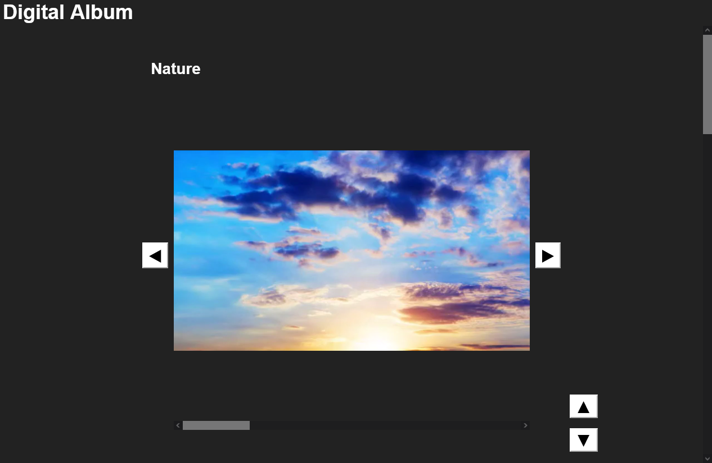

# Simple Digital Gallery

## Introduction
Accessing photos and videos locally stored in disparate locations can often be cumbersome and inefficient, especially when you want to appreciate them all across multiple folders. While some software and programs offer navigation features to browser through directories, or users may even rely on file explorer's preview function to view media content, these methods can be slow and disrupt the viewing experience.

(I think many of you are already familiar how slow the explorer can be when previewing photos and videos)

To enhance usability and provide a seamless experience, I am building a simple webpage template called **Simple Digital Gallery**  with `html` combined with `css` and `javascript`. This solution allows users to enjoy photos and video from multiple folders on the same webpage, without needing to switch between software and folders.

I hope **Simple Digital Gallery**  can greatly streamline the process, providing an enjoyable, uninterrupted way to access and display photos and videos.

## List of Features
You can find the **Simple Digital Gallery** [here](Gallery.html).

> 1. Navigation buttons to switch between media content within the same album
> 2. Buttons to scroll through and explore different albums
> 3. Hidden horizontal album scrollbar when there is only 1 item in an album
> 4. Auto-pause features for videos when less than 50% of the video is visible on screen.

**Screenshot:**

# Known issues
1. In chromium-based browsers, clicking the default scrollbar arrows once results in a jump across multiple items rather than moving to the next one. However, using the buttons functions correctly. So, I have temporarily hide the scrollbar arrows in chromium-based browsers.

(Note: Firefox works fine)

## Future Development
To automate the process, I plan to develop a Python script that will traverse through different folders and automatically organise all photos and videos into corresponding albums. This will streamline the workflow drastically, making it possible to add content with just a few steps, without having to deal with `html` coding.

Additionally, in future versions, I will focus on improving both the usability and appearance of **Simple Digital Gallery**. The enhancements include hiding the navigation buttons when there is only 1 item in an album, or reaching the end of an album.

## Update
- 02/01/2025: Version 0.1
	> - Build the structure of the digital gallery with html and css codes
	> - With buttons to navigate between photos and videos, and albums from different folders

---
#### Last update: 02/01/2025
